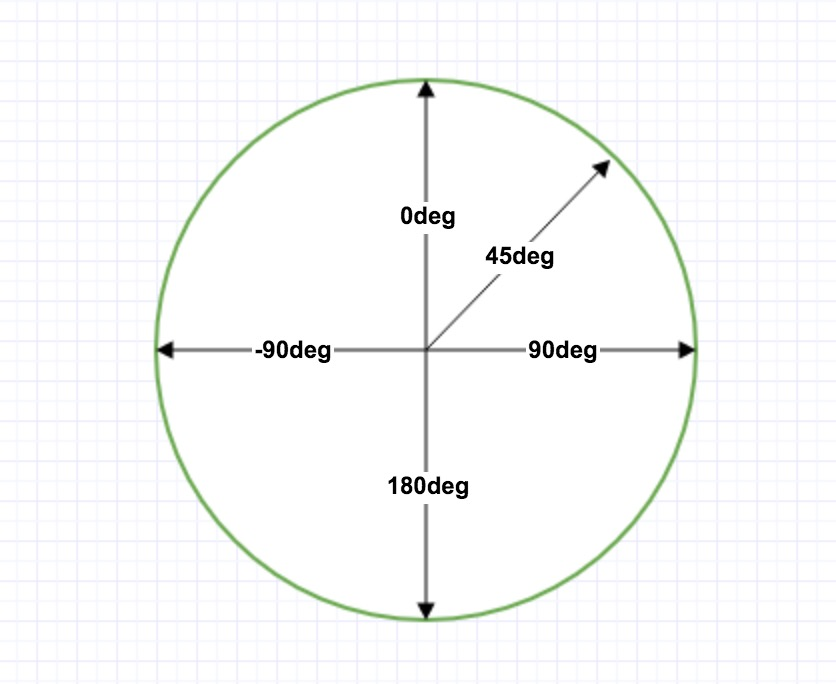

## 前言

　　为了更好的了解Web开发的__前端知识__，特意前来学习，主要__参考的资料__是<a href="https://www.runoob.com/">菜鸟编程</a>和b站up主-<a href="https://space.bilibili.com/95256449" >遇见狂神说</a>的教程

<!-- more -->

## 1. 什么是Css
　　Css是__Cascading Style Sheets__的缩写，意为层叠样式表；简单来说就是用来__让网页变得好看的__。
　　我们都知道Web开发的前端部分是由Html+Css+Js三大部分组成，其中__Html__属于__结构__，__Css__则是__表现__，而__Js__则是__交互__；用人体来说明的话就是Html属于骨骼或者叫骨架，Css则是肌肉组织~可以这么说吧大概。
## 2. Css发展历史
　　发展历史为：__Css1.0 -> Css2.0 ->Css2.1 ->Css3.0__
　　在__Css2.0__中提出了一个重要思想：__HTML和Css结构分离的思想__，这使得__网页变得更简单，且利于SEO__。
　　在__Css2.1__中加入了__浮动__和__定位__
　　在__Css3.0__中加入了__动画、阴影、圆角等__

## 3. Css基本语法
　　<b style="font-size:18px;">语法格式说明：</b>
```html
<html>
<head>
	<meta charset="UTF-8">
	<title>标题</title>
	
	<!-- 语法规范：
		选择器{
			声明1;
			声明2;
			...
		}
	-->
    
    <style>
        h1{ color:#000000;}
    </style>
</head>
<body>
<h1>标题1</h1>
</body>
</html>
```
## 4. Css的3种样式表
### I. 外部样式
　　__·	链接式：__
　　　　__示例：__	`<link rel="stylesheet" href="外部样式表的url地址">`  
　　　　__[说明：]__ 这是现在最常用的方法，这种方式__会将html和css完全渲染后才会加载。__
　　__·	导入式：__
　　　　__示例：__ `<style> @import url("外部样式表的url地址"); </style>`  
　　　　__[说明：]__ 这是Css2.1中提出的一种方法，这种方式__会先加载html再渲染css__，就会导致那种先出现一个很丑的网站，之后突然跳一下变好看的情况。

### II. 内部样式
　　__示例：__ `<style> Css语法 </style>`
　　__[说明：]__ 要写在`<head>`标签内

### III. 行内样式
　　__示例：__ `<p style="Css语法"></p>`
　　__[说明：]__ 在要添加样式的标签内用style属性写css语句
## 5. Css的选择器

### 5.1 Css的基本选择器

　　__·__  Css的基本选择器有3种，分别为：__标签选择器__、__类选择器__、__id选择器__

　　__·__  这三类基本选择器的优先级排序为：__id选择器>类选择器>标签选择器__ 

#### I. 标签选择器
　　· __选择一类标签__，如h1标签、b标签、p标签等
　　· __使用方法：__ `标签{}`
#### II. 类选择器
　　· __class，选择所有class属性一致的标签__，可实现__跨标签__
　　· __使用方法：__ `.类名{}`

#### III. id选择器
　　· __全局唯一__
　　· __使用方法：__ `#id编号{}`

### 5.2 Css的层次选择器
　　__·__  我们参考下面这张图来说明这里层次的含义，这里__body__为__最大的一层，即最外层__，后面的__p1、p2、p3和那个ul__为__一层__，而ul后面的li为一层，以此类推...  

　　__·__ 下面我们__用代码来表示上面的结构：__
```html
<html>
<head>
	<meta charset="UTF-8">
	<title>测试层次选择器</title>
	<style>
		<!-- 行内样式表 -->
		<!-- 要测试的样式表 -->
	</style>
</head>
<body>
	<p class="active">p1</p>
	<p>p2</p>
	<p>p3</p>
	<ul>
		<li>
			<p>p4</p>
		</li>
		<li>
			<p>p5</p>
		</li>
		<li>
			<p>p6</p>
		</li>
	</ul>
</body>
</html>
```
#### I. 后代选择器
　　__·__ <b style="font-size:18px;">说明：</b>选择__某一个元素后面__的__所有的层级__，例如：老爷爷 爷爷 爸爸 我，老爷爷的后代选择器就包括其后面所有的：爷爷 爸爸 我...
　　__·__ <b style="font-size:18px;">示例：</b>

```css
/*通用选择器*/
body p{
	background: red;
}
```

#### II. 子选择器
　　__·__ <b style="font-size:18px;">说明：</b>选择__某一个元素的下一层元素__，例如：爷爷 爸爸 我，爷爷的子选择器就只有爸爸“这一代”
　　__·__ <b  style="font-size:18px;">示例：</b>
```css
/*子选择器*/
body>p{
	background: red;
}
```

#### III. 相邻兄弟选择器
　　__·__  <b style="font-size:18px;">说明：</b>选择__某一个元素的同一层元素(同辈)，只有一个，且对下不对上，即：选择该元素同一层的下一个元素__，__只有一个__；例如：选择爸爸的相邻兄弟选择器 就会选择爸爸的兄弟，如你的叔叔啊、啥的
　　__·__  <b style="font-size:18px;">示例：</b>
```css
/*相邻兄弟选择器，只有一个，选择的相邻的（且取下不取上）*/
.active + p{
	background: red;
}
```

#### IV. 通用选择器
　　__·__ <b style="font-size:18px;">说明：</b>可以理解为__通用兄弟选择器__，即选择__当前元素的向下的所有兄弟元素(同一层元素)__
　　__·__  <b style="font-size:18px;">示例：</b>
```css
/*通用选择器，当前选中元素的向下的所有兄弟元素*/
.active ~ p{
	background: red;
}
```

### 5.3 Css结构伪类选择器

__[基本框架：]__ 依旧是一个简单的层次结构，第一层：body 第二层：3个p+1个ul  第三层：ul下的3个li。  
__[前提：]__ 不使用id、class选择器前提下来选择指定对象
```html
<!DOCTYPE html>
<html>
<head>
	<meta charset="UTF-8">
	<title>结构伪类选择器</title>
</head>

<body>
	<p>p1</p>
	<p>p2</p>
	<p>p3</p>
	<ul>
		<li>li1</li>
		<li>li2</li>
		<li>li3</li>
	</ul>
</body>

</html>	
```

__[示例1：]__ 选中ul的下的第一个li元素、最后一个li元素。  
```css
<!-- 前提：避免使用id和class选择器-->
<style>
    /*选中ul下的第一个li元素*/
    ul li:first-child{
    	background: #02ff00;
    }
    /*选中ul下的最后一个li元素*/
    ul li:last-child{
    	background: blue;
    }
</style>
```

__[示例2：]__ 选中p1所在的p元素。
```css
<!-- 前提：避免使用id和class选择器-->
<style>
	/*
		· 要求：选中p1；
		· 思路：定位到body（即父元素），选择其下的第一个元素；
		· p:ntn-child(1)的解析：
			选中当前p元素的父级元素（body元素），选中父级元素的第一个子元素，且为p元素时才生效。
	*/
	
	p:nth-child(1){
		background: yellow;
	}
	
	/*
		· p:ntn-of-type(2)的解析：
			选中当前p元素的父级元素（body元素），选中其下的p元素的第二个类型
	*/
	
	p:nth-of-type(2){
		background: #11EEEE;
	}
</style>
```

### 5.4 属性选择器(常用&重要)

__·__ __顾明思义：__通过标签中的各种属性来选择不同的标签    

__·__ __用法：__   

​    I.  标签 [ 属性名=属性值（__可以用正则__） ]{ css语法 }  如：__a[id=first]{ font-decoration: none; } __ 

​    II.  __=__   绝对等于	如：__a[id=first]{ font-decoration: none; }__  

​	III.  __*=__  包含这个元素	如：__a[class*="first"]{ background: red; }__   

​	IV.  __^=__  以...开头  	如：__a[href^=http]{ border-radius:10px; }__   

​	V.   __$=__  以...结尾   	如：__a[href$=.doc]{ color: green; }__   

__·__ __示例：__  

__Html部分：__  
```html
<!DOCTYPE html>
<html>
<head>
	<title>属性选择器_测试</title>
	<link rel="shortcut icon" 		href="https://ss0.bdstatic.com/70cFuHSh_Q1YnxGkpoWK1HF6hhy/it/u=982518211,682807425&fm=26&gp=0.jpg">
	<link rel="stylesheet" type="text/css" href="./css/属性选择器_style.css"> 
</head>
<body>
	<p class="demo">
		<a href="https://www.baidu.com" class="links item first" id="first_a">1</a>
		<a href="http://qqmail.com" class="links item active" target="_blank" title="test">2</a>
		<a href="images/123.html" class="links item">3</a>
		<a href="images/123.png" class="links item">4</a>
		<a href="images/123.jpg" class="links item">5</a>
		<a href="abc" class="links item">6</a>
		<a href="/a.pdf" class="links item">7</a>
		<a href="/abc.pdf" class="links item">8</a>
		<a href="abc.doc" class="links item">9</a>
		<a href="abc.doc" class="links item last">10</a>
	</p>
</body>
</html>
```

__Css代码：__  
```css
/* 这里用的是前面学过的层次选择器，选择的demo下的后代a标签 */
.demo a{
    float: left;
    display: block;
    height: 50px;
    width: 50px;
    border-radius: 10px;
    background: #764DB3;
    text-align: center;
    color: #E6E61A;
    text-decoration: none;
    margin-right: 5px;
    font: bold 20px/50px Arial;
}

/*选择id为first_a的a标签*/
a[id=first_a]{
	color: red;
}

/*选择class中出现过links的a标签*/
a[class*=links]{
	background: #3CC4C4;
}

/*选择href属性是以http开头的a标签*/
a[href^=http]{
	background: #E61AE6;
}

/*选择href属性是以doc结尾的a标签*/
a[href$=doc]{
	color: #C48D3C;
}

/*选择href属性是以.pdf结尾的a标签*/
a[href$=\.pdf]{
	background: #77887E;
}
```

## 6. 美化网页

### 6.1 字体样式

__·__  font-family：设置字体类型   

__·__  font-size：设置字体大小，可以用px(常用)或者em(少用)，一个em代表一个字的大小       

__·__  font-weight：设置字体粗细，可以用bolder、lighter等或数字（最大900=bolder）  

__·__  font-style：设置字体样式（斜体），可以用normal、italic和oblique来设置  

__·__  color：设置字体颜色

__·__  示例：


```css
<style>
	/*
		font-family: 设置字体样式
		font-size: 设置字体大小
		font-weight: 设置字体粗细
		font-style: 设置字体是否为斜体
		color: 设置字体颜色
	*/
	body{
		font-family: "Arial Black", 楷体;
		font-size: 20px;
		font-weight: bolder;
		color: red;
	}
	p{
        font-style: oblique;
	}
</style>

```

__·__ 可以使用__font属性__将__所有__的这些__字体样式__写到一起(顺序为：font-style font-weight font-size font-family)： 如：

```css
<style>
	p{
		font: oblique bolder 20px "楷体";
	}
</style>
```

__[ 注 ]__ <b style="color: #DD2248; font-size: 18px;">如何使用第三方字体文件？</b>

使用第三方字体，需要使用__@font-face__进行声明：格式为：__@font-face{ font-family: 给该字体起的名字;  src: url(第三方字体文件的url);}__，使用方法和普通设置字体的方法一致。

```css
@font-face{
    font-family: My_font_1;
    src: url('./font/font_1.ttf');
}
```

### 6.2 文本样式

1. __颜色__

   ​	__color属性__设置颜色，分三种：__单词描述__（red、green）  __RGB形式__（如：#000000 或 rgb(0,255,255)）  __RGBA形式__（rgba(0,255,255,0.9) 这里的A为透明度的意思，范围0~1）。

2. __对齐方式__

   ​	__text-align属性__设置水平对齐方式，可设置为left、center、right。

3. __首行缩进__

   ​	__text-indent属性__设置首行缩进距离，这里一般用em而不是px，如：常用：__首行缩进两个字符：__`text-indent: 2em`

4. __行高__

   ​	__line-height属性__设置行高，有时可以通过__将行高设置为块的高度__来__实现垂直方向的居中对齐__（<b style="color: rgb(255, 30, 10)">上下居中</b>）。

5. __装饰__（上、中、下划线）

   ​	__text-decoration属性__来设置各种划线，如：上划线：over-line  中划线：line-through  下划线：underline

   __Ps：__ 可以用该属性来__去除a标签的下划线__：  `text-decoration: none;`

6. __文本图片垂直方向对齐__

   ​	__vertical-align属性__可实现文本图片水平对齐的效果，如 ：`vertical-align: middle`  

__[ 示例： ]__

__HTML部分__

```html
<!DOCTYPE html>
<html>
<head>
	<title>文本样式</title>
</head>
<body>

<h1>围棋</h1>

<p class="p1">
	围棋，是一种策略型两人棋类游戏，中国古时称“弈”，西方名称“Go”。流行于东亚国家（中、日、韩、朝），属琴棋书画四艺之一。围棋起源于中国，传为帝尧所作，春秋战国时期即有记载。隋唐时经朝鲜传入日本，流传到欧美各国。围棋蕴含着中华文化的丰富内涵，它是中国文化与文明的体现。
</p>
<p class="p2">
	围棋使用长方形格状棋盘（看上去像正方形）及黑白二色圆形棋子进行对弈，棋盘上有纵横各19条线段将棋盘分成361个交叉点，棋子走在交叉点上，双方交替行棋，落子后不能移动，以围地多者为胜。因为黑方有先行占地之利，故而规则人为规定黑方局终时要给白方贴子。围棋被认为是世界上最复杂的棋盘游戏。中日韩等各国制定的竞赛规则略有不同。
</p>
<p class="p3">
	2019年11月，文化和旅游部办公厅组织开展了国家级非物质文化遗产代表性项目保护单位检查和调整工作，围棋保护单位为北京棋院（北京桥牌	院、北京市棋牌运动管理中心）。 
</p>

<p>
	
	左边是一张图片，我要和它居中对齐
</p>

</body>
</html>
```

__Css部分__

```css
h1{
    color: rgba(0, 255, 255, 0.8);
    text-align: center;
}
p:nth-of-type(1){
    text-indent: 2em;
    line-height: 20px;
}
body p:last-child{
    text-decoration: underline;
}
img{
    vertical-align: middle;
}
```

### 6.3 超链接伪类

__·__ 总共有四种，用于表示__a标签不同状态下的效果__，__常用的__只有`a:hover`这一种

__I.__ __未访问的链接状态__： `a: link{}`

__II.__  __已经访问/点击过的链接状态__： `a: visited{}`

__III.__  __鼠标悬浮在a标签上的状态__： `a: hover{}`

__IV.__  __鼠标点击a标签不松手的状态__：`a: active{}`

__[ 规则 ]__：

· __`a: hover`__使用时必须跟在__`a: link`__和__`a: visited`__的__后面__

· __`a: active`__使用时必须跟在__`a: hover`__的__后面__

__[示例]__：

__html部分:__

```html
<!DOCTYPE html>
<html>
<head>
	<title>超链接伪类</title>
</head>
<body>

<a href="#">
		
</a>
<p>
	<a href="#">码出高效：Java开发手册</a>
</p>
<p>
	<a href="#">作者：孤尽老师</a>
</p>
<p>
	<a href="#" id="price">99￥</a>	
</p>
	
</body>
</html>
```


__Css部分：__

```Css
a{
    /*去除所有a标签的下划线*/
    text-decoration: none;
}

/*设置鼠标悬停时的效果*/
a:hover{
    font-size: 20px;
    color: red;
}
```


### 6.4 阴影

__·__ __`text-shadow:`__属性表示阴影效果，其有4个值：__水平偏移量__ + __竖直偏移量__ + __阴影半径__ + __阴影颜色__

__[ 示例 ]__：

```css
/* html部分为上面的超链接伪类　*/
#price{
    text-shadow: 10px -5px 2px #000000;
}
```

### 6.5 列表样式

__·__ __`list-style`__属性用于设置__li标签的效果__，这是一个__简写属性__，可以将所有有关列表的属性都设置在一个声明中

__·__ __`list-style`__ 可设置的属性值为：__list-style-type__ + __list-style-position__ + __list-style-images__

__·__ __`list-style`__可以不设置其中的某个值，其中未设置的属性会使用默认值

__·__ __`list-style-type`属性__：设置列表项的标志类型，即设置每一个ul前面的符号样式

__·__ __`list-style-image`属性__：将图片设置为列表项的标志类型，即将ul前面的符号换成选择的图片

__·__ __`list-style-position`属性__：设置列表项标志的位置，__inside__：设置列表项标志放置在文本以内  | __outside__：__默认值__，设置列表项标志位于文本的左侧，列表项标志放置在文本以外

- | 属性名                    | 说明                                       | 属性值                                                       |
  | :------------------------ | ------------------------------------------ | ------------------------------------------------------------ |
  | __`list-style`__          | __简写属性__，可以设置全部与列表相关的属性 | __list-style-type__ + __list-style-position__ + __list-style-images__ |
  | __`list-style-type`__     | 设置__列表项__的__标志类型__               | __none、circle、square等__                                   |
  | __`list-style-image`__    | 将__图片__设置为__列表项的标志__           | __url(" 图片地址 ")__                                        |
  | __`list-style-position`__ | 设置__列表项标志__的__位置__               | __inside、outside__                                          |

__·__ __[示例]：__

__html部分__

```html
<!DOCTYPE html>
<html>
<head>
	<title>列表样式</title>

</head>
<body>

<div id="nav">
	<h2 class="title">主题市场</h2>
	<ul>
		<li>
			<a href="#">女装</a>/<a href="#">内衣</a>/<a href="#">家居</a>
		</li>
		<li>
			<a href="#">女鞋</a>/<a href="#">男鞋</a>/<a href="#">箱包</a>
		</li>
		<li>
			<a href="#">母婴</a>/<a href="#">童鞋</a>/<a href="#">玩具</a>
		</li>
		<li>
			<a href="#">男装</a>/<a href="#">户外运动</a>
		</li>
		<li>
			<a href="#">美妆</a>/<a href="#">彩妆</a>/<a href="#">个护</a>
		</li>
		<li>
			<a href="#">手机</a>/<a href="#">数码</a>/<a href="">企业</a>
		</li>
	</ul>
</div>


</body>
</html>
```

__css部分__

```css
#nav{
    width: 300px;
}
.title{
    text-indent: 1em;
    background: #C03E47FF;
}
ul{
    background: #778B8E
}
/*
	list-style-type：
		none：去原点
		circle 空心圆
		decrimal 数字
		square 正方形
*/
ul li{
    height: 30px;
    list-style-type: circle;
    text-indent: 1em;
}
a{
    font-size: 15px;
    text-decoration: none;
    color: #CF2F51FF
}
a:hover{
    text-decoration: underline;
    color: #2ED61B
}	
```

### 6.6 背景图像应用+渐变

#### 6.6.1 背景图片应用

​	`background`：__简写属性__，可以设置与背景相关的所有属性，__顺序__为：background-color、background-image、background-repeat、background-attachment、background-position

​	`background-color`：设置背景颜色

​	`background-image`：设置背景__图片__，属性常用__url()__表示

​	`background-repeat`：设置背景图片的__重复方式__，包括：水平重复(x-repeat)、垂直重复(y-repeat)、不重复(no-repeat)、水平垂直都重复(repeat)

​	`background-attachment`：设置背景图片是否固定或随页面的其余部分滚动，包括：scroll(默认，背景图随页面的滚动而滚动)、fixed（背景图不随页面滚动而滚动）、local（背景图片会随元素的内容的滚动而滚动）

​	`background-position`：设置背景图片的__位置__，包括：__方式一__：`left、right、bottom、top、center`  __方式二__：`x% y%`（水平位置 垂直位置，左下角为100% 100%） __方式三__：`xpos ypos`（水平位置 垂直位置，左上角是0，单位可以是像素或其他css单位）

__[ 示例 ]__：

__html部分__

```html
<!DOCTYPE html>
<html>
<head>
	<title>背景图片及渐变</title>
</head>
<body>
	<div class="div_1"><b>我是no-repeat：不重复，position为right bottom</b></div>
	<div class="div_2"><b>我是repeat-x：只在水平方向上重复</b></div>
	<div class="div_3"><b>我是repeat-y：只在垂直方向上重复</b></div>
	<div class="div_4"><b>我是repeat：x、y都重复</b></div>
	<div class="div_5"><b>我是no-repeat：不重复，position为right 5em</b></div>
</body>
</html>
```

__css部分__

```Css
div{
    width: 700px;
    height: 1000px;
    border: 5px solid #576619; 
    margin: 5px;
}
.div_1{
    background-image: url(img/bg.png);
    background-repeat: no-repeat;
    background-position: right bottom;
}
.div_2{
    background-image: url(img/bg.png);
    background-repeat: repeat-x;
}
.div_3{
    background-image: url(img/bg.png);
    background-repeat: repeat-y;
}
.div_4{
    background-image: url(img/bg.png);
    background-repeat: repeat;
}
.div_5{
    background: url(img/bg.png) no-repeat right 5em;
}
```

#### 6.6.2 渐变

​	· 渐变分为两种：__线性渐变__ 和 __径向渐变__

​	· __线性渐变__：`Linear Gradient` 向下/向上/向左/向右/对角方向

​	· __径向渐变__：`Radial Gradient` 由他们的中心定义

​	__I、线性渐变__

​		__·__ __格式__：`background-image: linear-gradient(方向,颜色1,颜色2....);`   

​		__·__ __预定义方向__：to bottom、to top、to right、to left、to bottom right 等

​		__·__ __方向使用角度__：格式：`background-image: linear-gradient(angle, color1, color2....);`

这里的__角度__是指__水平线和渐变线之间的角度，逆时针方向计算__，即：0deg将创建一个从下到上的渐变，90deg将创建一个从左到右的渐变。__Ps：__很多浏览器使用的是旧的标准：即0deg-从左到右，90deg从下到上。

角度图如下：



​	__II、径向渐变__

​		__·__ __格式__：`background-image: radial-gradient(shape size at position, start-color, ..., end-color);`

​		__·__  __颜色节点均匀分布__(默认情况下)：`background-image: radial-gradient(red, green, blue);`

​		__·__ __颜色节点不均匀分布__：`background-image: radial-gradient(red 5%, green 15%, blue 60%);`

​		__·__ __设置形状__：shape参数定义了形状，其值有：__circle__（圆）和__ellipse__（椭圆）。如：`background-image: radial-gradient(circle, red, green, blue);`

​		__·__ __不同尺寸大小关键字的使用__：size参数定义了渐变的大小，它有以下的四个值：__closest-side__、__farthest-side__、__closest-corner__、__farthest-corner__

​		__·__ __重复的径向渐变__：`repeating-radial-gradient()`函数用来设置重复的径向渐变

## 7. 盒子模型


###  7.1 什么是盒子模型

**margin：**外边距，清除边框外的区域

**padding：**内边距，清除内容周围的区域

**border：**边框

**content：**盒子/元素内容，即文本或者图像等


