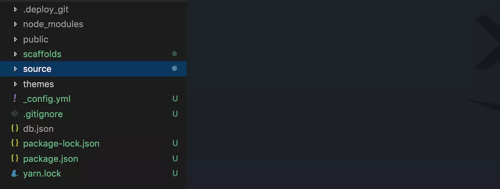

### 一、简介：
__· hexo__是一个快速、简介且高效的博客框架，可以理解为基于__node.js__制作的一个博客工具  
__· hexo__正常情况下不需要部署到我们的服务器上，我们的服务器上保存的，其实是基于hexo通过markdown编写的文章，然后hexo帮助我们生成__静态的html页面__，然后将生成的html上传到我们的服务器。  
__·__ 简而言之，__hexo__是一个__静态页面__ _生成、上传的工具_    
<!-- more -->
### 二、源码结构：
  
***  
|  文件/文件夹  |  说明  |
| :-  |  :-  |
| \_config.yml   |  配置文件  |
| package.json  |  框架的基本参数信息和它所依赖的插件，在npm安装时使用的--save保存进去
| public        |  生成的静态文件，这个目录最终会发布到服务器  |
| scaffolds     |  一些通用的makedown模板  |
| source        |  编写的makedown文件，\_drafts草稿文件，\_posts发布的文章  |
| themes        |  博客的模板  |  

### 三、安装
#### 1. 安装前提
__·__ [Node.js](https://nodejs.org/en/) (版本不得低于8.10，建议使用10.0及以上版本)  
__·__ [Git](https://nodejs.org/en/)
#### 2. 安装Git
__. Windows__：下载并安装[git](https://git-scm.com/)(可用[淘宝镜像](https://npm.taobao.org/mirrors/git-for-windows/)来下载)  
__· Mac__：使用[Homebrew](http://mxcl.github.com/homebrew/)，[MacPorts](https://www.macports.org/)或者下载[安装程序](http://sourceforge.net/projects/git-osx-installer/)  
__· Linux(Ubuntu，Debian)__：`sudo apt-get install git-core`  
__· Linux(Fedora，Red Hat，CentOS)__：`sudo yum install git-core`  
#### 3. 安装Node.js
Node.js为大多数平台提供了官方的[安装程序](https://nodejs.org/en/download/)，国内依旧可以使用[淘宝镜像Node.js镜像](https://npm.taobao.org/mirrors/node)来下载。  

其他安装方法：  
__· windows__：通过[nvs](https://github.com/jasongin/nvs/)(推荐)或者[nvm](https://github.com/nvm-sh/nvm)来安装  
__· Mac__：使用[Homebrew](https://brew.sh/)或[MacPorts](http://www.macports.org/)安装  
__· Linux(DEB/RPM-based)__：从[NodeSource](https://github.com/nodesource/distributions)安装  
__· 其他__：使用相应的软件包管理器进行安装，可以参考由Node.js提供的[指导](https://nodejs.org/en/download/package-manager/)  

ps：①　对于__Mac/Linux__同样建议使用nvs或nvm，以避免可能会出现的各种权限问题  
　　②　对于__Windows用户__，使用Node.js官方安装程序时，请确保勾选__Add to   PATH__选项(默认已经勾选)  
　　③　对于__Mac/Linux用户__，如果在尝试安装Hexo过程中出现`EACCES`权限错误，请遵循[由npmjs发布的指导](https://docs.npmjs.com/resolving-eacces-permissions-errors-when-installing-packages-globally)修复该问题；强烈建议__不要__使用root、sudo等方法覆盖权限  
#### 4. 安装Hexo
所有必备的应用程序安装完成后，即可使用npm安装Hexo。

`npm install -g hexo-cli`  

#### 5. Hexo的使用
安装以后，可以使用以下两种方式执行Hexo：  
I. `npx hexo <command>`  
II. 将Hexo所在的目录下的`node_modules`添加到环境变量之中，即可直接使用`hexo <command>`  

