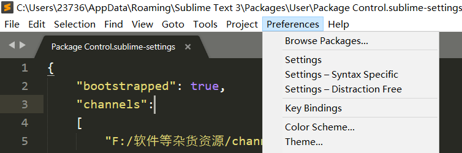
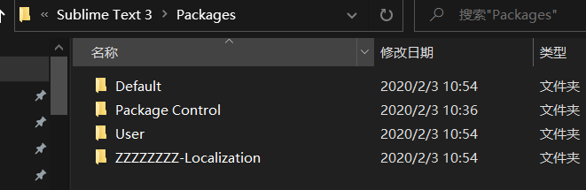
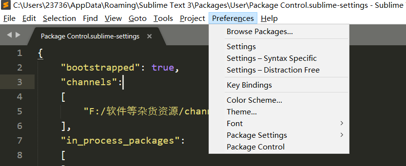
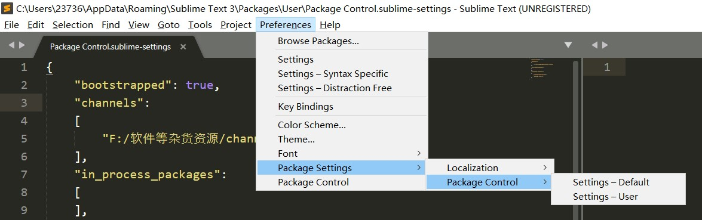
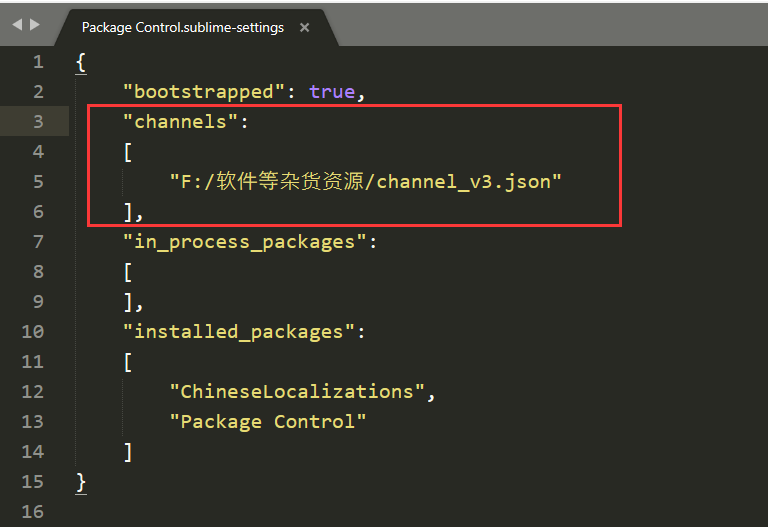

---
title: sublime test3安装Package Control问题
date: 2020-02-03 
tags: [sublime, 插件]
---
## 一.　简介
①　最近开始使用sublime text3来进行文本编辑、写写脚本什么的，之前用过sublime text2，但是插件这部分一直没捣鼓，导致之前用的也就是像个好看点的记事本:sleepy :，而sublime的__插件扩展机制__是通过__Package Control__来实现的；  
②　sublime的插件机制类似于Chrome浏览器的插件，用来扩展功能；而今天要说的Package Control则是用来为Sublime安装其他插件的插件，类似于Python的pip  
<!--more-->
## 二.　安装
### 1. 方法一：（在线安装）  
打开sublime text3，按``CTRL+` ``调出console，将下述代码粘贴到命令行中，直接Enter执行：  

` import urllib.request,os,hashlib; h = '6f4c264a24d933ce70df5dedcf1dcaee' + 'ebe013ee18cced0ef93d5f746d80ef60'; pf = 'Package Control.sublime-package'; ipp  = sublime.installed_packages_path(); urllib.request.install_opener( urllib.request.build_opener( urllib.request.ProxyHandler()) ); by = urllib.request.urlopen( 'http://packagecontrol.io/' + pf.replace(' ', '%20')).read(); dh = hashlib.sha256(by).hexdigest(); print('Error validating download (got %s instead of %s), please try           manual install' % (dh, h)) if dh != h else open(os.path.join( ipp, pf), 'wb' ).write(by)`  

但是这个方法最后失败，sublime一直卡住，没有响应
### 2.方法二：(离线安装)
下载地址：[https://github.com/wbond/package_control](https://github.com/wbond/package_control)
1. 点击上面的链接，去github下载Package  Control安装包下载到本地，下载到的文件为__package_control-master.zip__，将其解压后的文件夹重命名为__Package Control__；
2. 打开Sublime，选择`Preferences->Browse Pacakges菜单`，如图1，将上面的改好名字的Package Control文件夹复制过去，如图2，之后重启Sublime  ；

图一
  

***

  

图二
  

***

3. 重启之后，可在__Preferences选项__下看到__Package Control__和__Package Settings__，说明安装成功，如图三；  

  

图三

***

4. 在这里我出现了个大问题，即使上面已经安装成功了，但是，按``CTRL+shift+P``(或者`Tools->Command Paletter`)在跳出的输入栏中输入`Install Package`却会出现__There are no packages available for installation__的错误提示，试了多种办法后最终解决；

___解决方法：___  
a. 下载一个[channel_v3.json](https://pan.baidu.com/s/1is6SVhhUoOMJgV1og5ZLeg)文件;  
b. 下载完成后，打开Sublime的`Perferences->Package Settings->Package Control->Settings-User`，如图四所示，之后添加如下代码:``"channels":["<这里是上面下载的channel_vs.json的文件路径>"] ``，如图五所示；  
  
  

图四

***
  

图五
  

***

